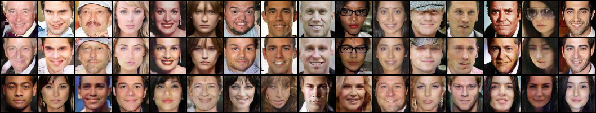

# Master's thesis
This repository contains the code used for my master thesis. 
The Thesis itself should be available at https://essay.utwente.nl/82651/ and is [also included in this repo](Master_Thesis_Final.pdf).

Example output of the MorGAN_disl3 model with each column showing input from validation at the top, 
reconstructed input in the middle, and a randomly generated face at the bottom:

Note: I have attempted to keep this repository clean and well-commented, but the large number of different combinations of models/algorithms/datasets/etc. have made the dream of 100% readable and fully-tested code impossible.

## Installing
You can install the requirements for running the code using `pip install -r`. Since this is older code, you need a python version between 3.5 and 3.8 (inclusive). 
Higher torch versions will break

## Running
Note: The `--help` option can be used with all modules listed below to get all commandline parameters.

### Training
An example of training the 28x28 pixels cropped_CelebA model with some parameters:
`python -m experiments.celeba_cropped28.celeba_MorGAN --cuda --h_size=24 --l_size=128 --epochs=100`
Training results will be put in a folder named `results` at every epoch, including images and checkpoints

### Latent space explorer
The latent space explorer is a TKInter program that can be used to play around with the latent space of a model.
Run it using: `python -m evaluation.latent_space_explorer`.
It will prompt you for a generator model, which is usually `results/<path>/<to>/<run>/params/all_epochs/Gx.pt`

### Other scripts
The evaluation folder also contains a number of other evaluation scripts. 
These can also be run, but might require extra dependencies. 
Refer to their respective `--help` or comments for more info.
